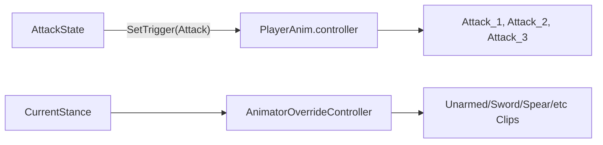

# 攻击动画 Controller 方案

## 推荐结构

当前项目已经是“基础 `PlayerAnim.controller` + 姿态 `AnimatorOverrideController`”模式，相关代码在 [`Assets/Scripts/Player/PlayerStanceController.cs`](Assets/Scripts/Player/PlayerStanceController.cs) 和 [`Assets/Scripts/Player/StanceDatabase.cs`](Assets/Scripts/Player/StanceDatabase.cs)。所以攻击不要给 Relax、Unarmed、Sword 各做一份完整 Controller，而是在基础 Controller 里放通用攻击槽位：

## Animator 里怎么做

在 [`Assets/Animator/PlayerAnim.controller`](Assets/Animator/PlayerAnim.controller) 里新增参数和状态：

- 新增 Trigger：`Attack`
- 可选新增 Int：`ComboIndex`，后面做 1/2/3 段连击时用
- 新增状态：`Attack_1`，以后再扩展 `Attack_2`、`Attack_3`
- `Any State -> Attack_1`，条件是 `Attack` Trigger，关闭 `Has Exit Time`
- `Attack_1 -> MoveTree`，打开 `Has Exit Time`，Exit Time 约 `0.85-1`
- 给 `Attack_1` 的动画状态加 Tag：`Attack`，方便代码检测

基础 Controller 中的 `Attack_1` 放一个“占位攻击动画 Clip”。这个 Clip 不一定最终播放，重点是它会出现在 OverrideController 的可替换列表里。

## 各姿态怎么配

`Relax`：
- 不需要攻击 Clip。
- 在 `StanceDatabase` 对应 Relax Entry 里把 `MaxComboCount` 设为 `0`，表示不能攻击。
- 代码层也应判断 `MaxCombo > 0`，这样 Relax 左键不会进入攻击。

`Unarmed`：
- 使用 `PlayerAnim_Unarmed.overrideController`。
- 把基础 Controller 里的 `Attack_1` 占位 Clip 替换成空手攻击动画。
- 如果有连击，再替换 `Attack_2`、`Attack_3`。

武器姿态，例如 `OneHandSword`、`TwoHandSpear`：
- 每种武器做一个新的 `AnimatorOverrideController`，都继承 `PlayerAnim.controller`。
- 只替换移动、跳跃、翻滚、攻击这些 Clip。
- 在 `StanceDatabase` 里新增对应 Entry，绑定 OverrideController，并设置 `MaxComboCount`。

## 代码配合建议

现有 [`Assets/Scripts/Player/States/AttackState.cs`](Assets/Scripts/Player/States/AttackState.cs) 已经调用 `player.animator.SetTrigger("Attack")`，这部分可以继续沿用。但建议后续把“造成伤害”从 `Enter()` 挪到动画事件 `Hit()`，这样命中发生在挥拳/挥剑那一帧，而不是按下鼠标瞬间。

另外，目前 [`Assets/Scripts/Player/PlayerController.cs`](Assets/Scripts/Player/PlayerController.cs) 里只允许 `CurrentStance == PlayerStance.Armed` 攻击，这会挡住 `Unarmed` 和各种具体武器。建议改成依据 `StanceController.MaxCombo > 0` 判断是否可攻击。

## 最小落地顺序

1. 先在 `PlayerAnim.controller` 做一个 `Attack_1` 状态和 `Attack` Trigger。
2. 给基础 Controller 的 `Attack_1` 放一个占位攻击 Clip。
3. 在 `PlayerAnim_Unarmed.overrideController` 替换 `Attack_1` 为空手攻击。
4. 在 `PlayerAnim_Armed.overrideController` 替换 `Attack_1` 为当前武器攻击。
5. 把 Relax 的 `MaxComboCount` 配成 `0`，并让代码用 `MaxCombo > 0` 控制能否攻击。
6. 后面需要连击时，再加 `Attack_2/Attack_3` 和 `ComboIndex`。