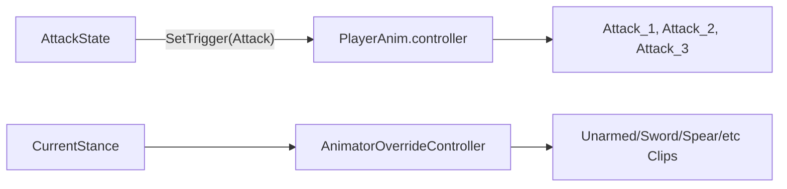

# 攻击动画 Controller 方案

## 推荐结构

当前项目已经是“基础 `PlayerAnim.controller` + 姿态 `AnimatorOverrideController`”模式，相关代码在 [`Assets/Scripts/Player/PlayerStanceController.cs`](Assets/Scripts/Player/PlayerStanceController.cs) 和 [`Assets/Scripts/Player/StanceDatabase.cs`](Assets/Scripts/Player/StanceDatabase.cs)。所以攻击不要给 Relax、Unarmed、Sword 各做一份完整 Controller，而是在基础 Controller 里放通用攻击槽位：

## Animator 里怎么做

在 [`Assets/Animator/PlayerAnim.controller`](Assets/Animator/PlayerAnim.controller) 里新增参数和状态：

- 新增 Trigger：`Attack`
- 新增 Int：`ComboIndex`
- 新增状态：`Attack_1`、`Attack_2`、`Attack_3`、`Attack_4`
- `Any State -> Attack_1`，条件是 `Attack` Trigger + `ComboIndex == 1`，关闭 `Has Exit Time`
- `Attack_1 -> Attack_2`，条件是 `Attack` Trigger + `ComboIndex == 2`
- `Attack_2 -> Attack_3`，条件是 `Attack` Trigger + `ComboIndex == 3`
- `Attack_3 -> Attack_4`，条件是 `Attack` Trigger + `ComboIndex == 4`
- 每个攻击状态都要有一条回到 `MoveTree` 的线，打开 `Has Exit Time`，Exit Time 约 `0.85-1`
- 给所有攻击动画状态加 Tag：`Attack`，方便代码检测

基础 Controller 中的 `Attack_1/2/3/4` 放“占位攻击动画 Clip”。这些 Clip 不一定最终播放，重点是它们会出现在 OverrideController 的可替换列表里。

## 各姿态怎么配

`Relax`：
- 不需要攻击 Clip。
- 在 `StanceDatabase` 对应 Relax Entry 里把 `MaxComboCount` 设为 `0`，表示不能攻击。
- 代码层也应判断 `MaxCombo > 0`，这样 Relax 左键不会进入攻击。

`Unarmed`：
- 使用 `PlayerAnim_Unarmed.overrideController`。
- 把基础 Controller 里的 `Attack_1` 占位 Clip 替换成空手攻击动画。
- 如果空手只有一段攻击，`MaxComboCount` 保持 `1` 即可。
- 如果空手也要连击，再替换 `Attack_2`、`Attack_3`、`Attack_4`，并提高 `MaxComboCount`。

武器姿态，例如 `OneHandSword`、`TwoHandSpear`：
- 每种武器做一个新的 `AnimatorOverrideController`，都继承 `PlayerAnim.controller`。
- 只替换移动、跳跃、翻滚、攻击这些 Clip。
- 在 `StanceDatabase` 里新增对应 Entry，绑定 OverrideController，并设置 `MaxComboCount`。

## 代码配合建议

现有 [`Assets/Scripts/Player/States/AttackState.cs`](Assets/Scripts/Player/States/AttackState.cs) 已经会：

- 第一次攻击设置 `ComboIndex = 1` 并触发 `Attack`
- 在攻击动画 `35% ~ 80%` 的窗口内接受下一次点击
- 根据 `StanceController.MaxCombo` 限制最大连击段数
- 每次进入新攻击段时调用 `AttackExecutor.SetCurrentComboIndex(comboIndex)`
- 攻击结束后按输入回到 `MoveState` 或 `IdleState`

[`Assets/Scripts/Player/PlayerController.cs`](Assets/Scripts/Player/PlayerController.cs) 已经通过 `CanAttack` 判断是否能攻击，Relax 只要在 `StanceDatabase` 里保持 `MaxComboCount = 0` 就不会进入攻击。

具体命中不再写在 `AttackState` 或 `PlayerController` 中，而是交给 [`Assets/Scripts/Combat/AttackExecutor.cs`](Assets/Scripts/Combat/AttackExecutor.cs)。`AttackExecutor` 会根据当前 `PlayerStance + ComboIndex` 从 [`Assets/Scripts/Combat/PlayerAttackLoadout.cs`](Assets/Scripts/Combat/PlayerAttackLoadout.cs) 取到 `AttackProfile`，再按 `AttackProfile.DeliveryType` 执行不同攻击方式。

## 通用攻击执行

动画事件统一挂在 [`Assets/Scripts/Player/PlayerAnimationEventReceiver.cs`](Assets/Scripts/Player/PlayerAnimationEventReceiver.cs)：

- 近战命中帧调用 `Hit()`。
- 枪械开火帧调用 `Shoot()`。
- 弓箭放箭帧调用 `Shoot()`。
- AOE 爆发帧调用 `Aoe()`。

这些事件都会转发给 `AttackExecutor`。实际执行近战、射线、投射物还是 AOE，由当前段的 `AttackProfile` 决定。

当前测试配置：

- `Assets/Combat/AttackProfiles/Unarmed_Attack_1.asset`：`MeleeArc`
- `Assets/Combat/AttackProfiles/Gun_Attack_1.asset`：`Raycast`
- `Assets/Combat/AttackProfiles/Bow_Attack_1.asset`：`Projectile`
- `Assets/Combat/AttackProfiles/Staff_Aoe_1.asset`：`AoeAtPoint`

`Assets/Scenes/Main.unity` 的 Player 已挂载：

- `AttackExecutor`
- `PlayerAttackLoadout`
- `PlayerAnimationEventReceiver`

## 后续要做

1. 给正式武器/姿态补完整 Profile。
   - 每个 `PlayerStance + ComboIndex` 可以配置不同 `AttackProfile`。
   - 单手剑、长矛、弓箭、枪械、法杖都不需要改 `AttackState`。

2. 补正式投射物预制体。
   - 当前 `TestArrowProjectile.prefab` 只是测试触发器。
   - 正式箭矢/子弹可以替换模型、速度、生命周期和命中特效。

3. 调整连击手感。
   - 当前连击输入窗口是 `35% ~ 80%`。
   - 每种武器的手感不同，后续可以把连击窗口做成每段攻击独立配置。
   - 重武器窗口可以更晚，轻武器窗口可以更早。

## 当前检查点

- `Attack` Trigger 已能触发攻击状态。
- `ComboIndex` 已用等于条件连接 `Attack_1/2/3/4`。
- `AttackState` 已根据 `MaxCombo` 控制能打几段。
- `Relax` 可通过 `MaxComboCount = 0` 禁止攻击。
- 命中执行已迁移到 `AttackProfile + AttackExecutor`。
- 下一步优先给正式武器姿态补齐 Profile 和动画事件。