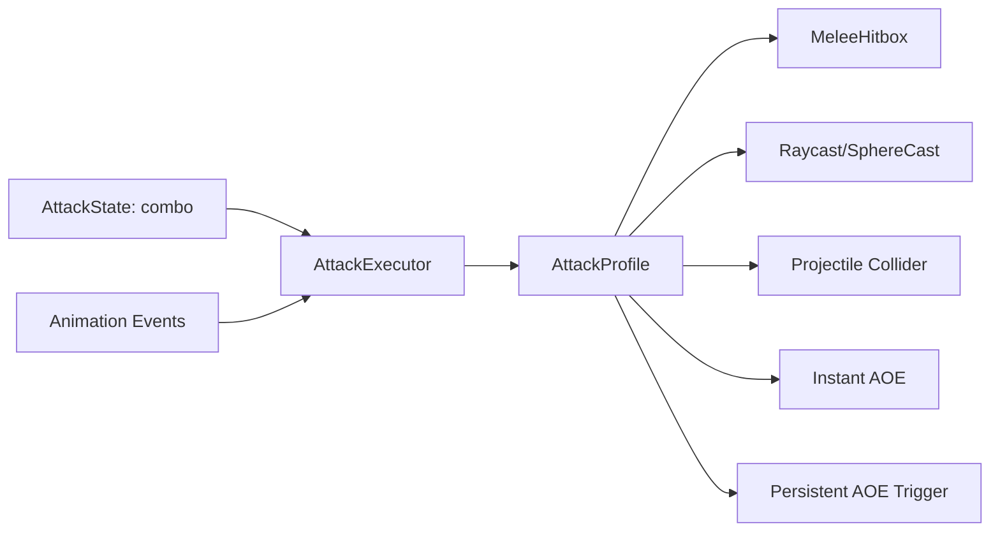

# 通用攻击命中系统开发文档

## 背景

当前项目已经有基础连击链路：

- `AttackState` 负责进入攻击、记录 `ComboIndex`、控制连击窗口。
- `PlayerAnim.controller` 负责播放 `Attack_1/2/3/4`。
- `AttackProfile + PlayerAttackLoadout + AttackExecutor` 负责按姿态和连击段执行命中。

下一步目标是把命中检测从“动画某一帧执行一次检测”升级成更接近正式 RPG 的结构：



核心原则：

- `AttackProfile` 负责配置攻击时机。
- 碰撞、射线、投射物、AOE 负责真实命中。
- `AttackProfile` 决定每一段攻击的命中模型。
- `AttackState` 不关心是近战、枪械、弓箭还是法术。

## 命中类型

### MeleeHitbox

适合拳头、剑、斧、长矛等近战攻击。

流程：

```text
AttackStart
↓
AttackExecutor 开启当前武器/拳头 Hitbox
↓
Hitbox OnTriggerEnter 碰到 Enemy
↓
AttackExecutor.ApplyDamage
↓
AttackEnd
↓
关闭 Hitbox
```

特点：

- 命中由真实碰撞决定。
- 武器长短、扫动轨迹更自然。
- 一段攻击内需要记录已命中的敌人，避免重复伤害。
- 高速武器后续可升级为 `SphereCast / CapsuleCast` 防穿透。

### Raycast

适合枪械、激光、瞬发魔法射线。

流程：

```text
AttackRelease
↓
从枪口或屏幕准星方向发 Raycast/SphereCast
↓
命中 Enemy Collider
↓
ApplyDamage
↓
播放枪口、弹痕、命中特效
```

说明：

- 枪械通常不生成真实子弹碰撞体。
- 视觉弹道可以是特效，逻辑命中用射线。
- 如果想要更宽容的命中，可用 `SphereCast` 替代 `Raycast`。

### Projectile

适合弓箭、飞刀、火球、冰锥等有飞行时间的攻击。

流程：

```text
AttackRelease
↓
生成 Projectile Prefab
↓
Projectile 带 Collider / Trigger
↓
飞行中 OnTriggerEnter
↓
ApplyDamage
↓
销毁或播放爆炸
```

说明：

- 适合可以被闪避、拦截、飞行较慢的攻击。
- 投射物可由 `AttackProfile` 配置速度、生命周期、Prefab。

### InstantAoe

适合爆炸、落雷、震地、瞬间治疗圈。

流程：

```text
AttackRelease
↓
计算 AOE 中心点
↓
Physics.OverlapSphere / OverlapBox
↓
范围内目标 ApplyDamage
```

说明：

- 不需要长期存在的碰撞体。
- 适合一次性爆发。

### PersistentAoe

适合火墙、毒圈、暴风雪、持续治疗区域。

流程：

```text
AttackRelease
↓
生成 Area Prefab
↓
Area Trigger 记录范围内目标
↓
按 TickInterval 周期结算
↓
持续时间结束销毁
```

说明：

- 需要独立 `AttackArea` 脚本。
- 支持持续伤害、持续治疗、减速等效果。

## AttackProfile 设计

建议把 `AttackDeliveryType` 调整为：

```csharp
public enum AttackDeliveryType
{
    MeleeArc,       // 保留作简单测试或无武器模型时的近战范围
    MeleeHitbox,    // 正式近战武器/拳脚
    Raycast,        // 枪械、激光
    Projectile,     // 弓箭、法球
    InstantAoe,     // 爆炸、落雷
    PersistentAoe   // 火墙、毒圈
}
```

`AttackProfile` 保留通用字段：

- `Damage`
- `TargetLayers`
- `HitEffectPrefab`

各类型需要的字段：

- `MeleeHitbox`：`HitboxName` 或 `HitboxGroup`
- `Raycast`：`MaxDistance`、`SpreadAngle`、`CastRadius`
- `Projectile`：`ProjectilePrefab`、`SpawnPointName`、`ProjectileSpeed`、`ProjectileLifeTime`
- `InstantAoe`：`AoeRadius`、`AoeOffset`、`AoeDelay`
- `PersistentAoe`：`AreaPrefab`、`AoeRadius`、`Duration`、`TickInterval`

## 攻击时机约定

攻击时机默认不再依赖动画事件，而是由 `AttackProfile` 配置：

- `StartTime`：开启近战 Hitbox 的时机。
- `ReleaseTime`：释放射线、投射物、AOE 的时机。
- `EndTime`：关闭近战 Hitbox 的时机。

`AttackState` 会读取当前 `ComboIndex` 对应的 `AttackProfile`，根据攻击动画的 `normalizedTime` 自动调用：

- `AttackStart()`
- `AttackRelease()`
- `AttackEnd()`

不同攻击类型的使用方式：

- 近战：
  - `AttackStart()`：开启 Hitbox
  - `AttackEnd()`：关闭 Hitbox

- 枪械：
  - `AttackRelease()`：执行 Raycast / SphereCast

- 弓箭 / 法球：
  - `AttackRelease()`：生成 Projectile

- 瞬时 AOE：
  - `AttackRelease()`：执行 Overlap 检测

- 持续 AOE：
  - `AttackRelease()`：生成 Area Trigger

动画事件仍作为兼容层保留：

- 旧动画事件 `Hit()` 可转发到 `AttackRelease()`。
- 旧动画事件 `Shoot()` 可转发到 `AttackRelease()`。
- 旧动画事件 `Aoe()` 可转发到 `AttackRelease()`。
- 新动画事件 `AttackStart()`、`AttackRelease()`、`AttackEnd()` 也可以继续使用，但不是必需配置。

## 新增组件

### AttackHitbox

挂在武器、拳头、脚等 Hitbox 对象上。

职责：

- 默认禁用 Collider。
- `EnableHitbox(profile, executor)` 时开启检测。
- `DisableHitbox()` 时关闭检测。
- `OnTriggerEnter` 找到 `EnemyController` 后调用 `AttackExecutor.ApplyDamage()`。
- 一段攻击内避免重复命中同一目标。

要求：

- Collider 必须 `isTrigger = true`。
- Hitbox 对象通常挂在骨骼或武器模型下。
- `HitboxName` 用于精确匹配单个碰撞体，例如 `RightFist`、`SwordBlade`。
- `HitboxGroup` 用于同时开启一组碰撞体，例如 `Fists`、`Feet`、`TwoHandWeapon`。
- 如果 `AttackProfile.HitboxName` 和 `AttackProfile.HitboxGroup` 都为空，则开启所有 Hitbox，适合早期测试。

### AttackHitboxController

挂在 Player 或武器根节点上。

职责：

- 管理多个 `AttackHitbox`。
- 根据 `AttackProfile.HitboxName` 或 `AttackProfile.HitboxGroup` 找到本次攻击要开启的 Hitbox。
- `AttackStart()` 开启。
- `AttackEnd()` 关闭。
- 攻击被打断或状态退出时强制关闭全部 Hitbox。

### AttackArea

用于持续 AOE。

职责：

- 生成后持续一段时间。
- 记录 Trigger 内目标。
- 按 `TickInterval` 周期结算伤害。
- 生命周期结束后销毁。

## AttackExecutor 修改方向

`AttackExecutor` 保持唯一攻击执行入口。

建议新增方法：

```csharp
public void AttackStart()
public void AttackRelease()
public void AttackEnd()
```

内部根据当前 `AttackProfile.DeliveryType` 分发：

- `MeleeHitbox`
  - `AttackStart()` 开启 Hitbox
  - `AttackEnd()` 关闭 Hitbox

- `Raycast`
  - `AttackRelease()` 执行射线

- `Projectile`
  - `AttackRelease()` 生成投射物

- `InstantAoe`
  - `AttackRelease()` 执行范围检测

- `PersistentAoe`
  - `AttackRelease()` 生成持续区域

`ApplyDamage()` 继续作为统一伤害入口。

## 落地步骤

1. 扩展 `AttackDeliveryType`。
   - 新增 `MeleeHitbox`、`InstantAoe`、`PersistentAoe`。
   - 保留 `MeleeArc` 作为简单测试方案。

2. 扩展 `AttackProfile`。
   - 加入 Hitbox、Cast、持续 AOE 所需字段。
   - 加入 `StartTime`、`ReleaseTime`、`EndTime`，由代码按动画进度自动触发攻击阶段。
   - 保持已有 Profile 可迁移。

3. 新建 `AttackHitbox`。
   - 支持 Trigger 命中。
   - 调用 `AttackExecutor.ApplyDamage()`。
   - 防止同一段攻击重复命中。

4. 新建 `AttackHitboxController`。
   - 管理 Player/武器上的 Hitbox。
   - 支持按名称开启指定 Hitbox。

5. 修改 `AttackExecutor`。
   - 增加 `AttackStart / AttackRelease / AttackEnd`。
   - `MeleeHitbox` 走 Hitbox。
   - `Raycast / Projectile / InstantAoe / PersistentAoe` 走各自执行逻辑。
   - `MeleeArc` 保留为 fallback。

6. 修改 `PlayerAnimationEventReceiver`。
   - 新增 `AttackStart()`、`AttackRelease()`、`AttackEnd()`。
   - 旧的 `Hit()`、`Shoot()`、`Aoe()` 临时保留并转发。

7. 新建 `AttackArea`。
   - 支持持续 AOE。
   - 配置持续时间、Tick 间隔、目标层级。

8. 配置测试对象。
   - 空手/剑：`MeleeHitbox`
   - 手枪：`Raycast`
   - 弓箭：`Projectile`
   - 法杖爆炸：`InstantAoe`
   - 毒圈/火圈：`PersistentAoe`

9. 配置攻击时机。
   - 近战配置 `StartTime` 和 `EndTime`。
   - 远程/法术配置 `ReleaseTime`。
   - 动画事件只保留作兼容或特殊动作使用。

## 测试清单

- Relax 姿态不能攻击。
- Unarmed 能进入攻击并开启拳头 Hitbox。
- 近战一段攻击内同一敌人只受一次伤害。
- 枪械在 `ReleaseTime` 可以命中准星方向敌人。
- 弓箭生成 Projectile，Projectile 碰撞后结算伤害。
- InstantAoe 只伤害范围内敌人。
- PersistentAoe 按 Tick 间隔持续伤害。
- 连击切段时，`ComboIndex` 对应正确 `AttackProfile`。
- 攻击中断、翻滚、跳跃或死亡时，所有 Hitbox 会关闭。

## 当前建议

下一步优先实现：

1. `MeleeHitbox`
2. `StartTime / EndTime`
3. `ReleaseTime`
4. `InstantAoe / PersistentAoe`

这样近战会先变成真实碰撞，远程和 AOE 也能保持数据驱动。
